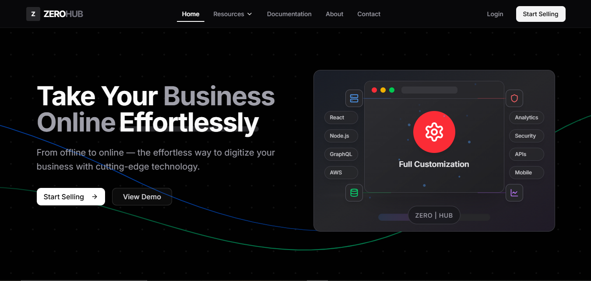
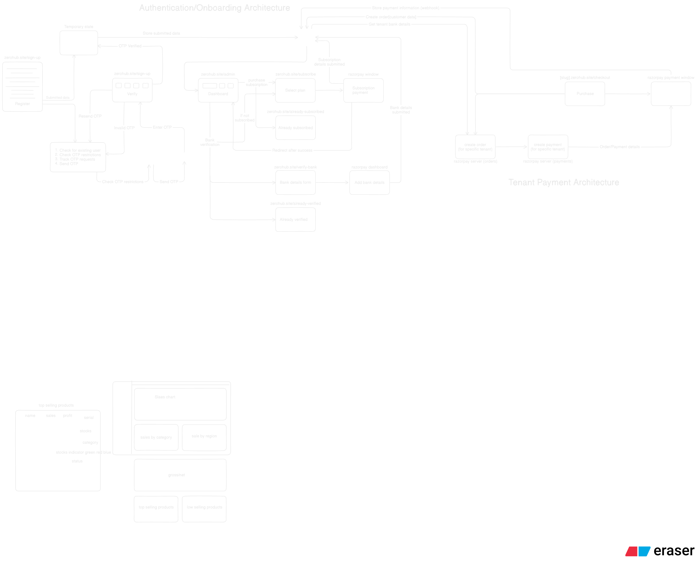

<div align="center">

# 🚀 ZERO | HUB

### ✨ Transform Your E-commerce Vision into Reality ✨

<p align="center">
  
</p>

<div align="center">
  
  [](https://zerohub.site)
  [](https://ashishport.vercel.app)
  [](mailto:ashishjadhav9900@gmail.com)
  
</div>

---



</div>

## 🎯 What is ZERO | HUB?

<table>
<tr>
<td width="50%">

**ZERO | HUB** is not just another e-commerce platform. It's a **game-changing solution** that transforms how businesses approach online selling.

🎪 **Zero Setup Complexity**  
🎯 **Hub of All Features**  
🚀 **Infinite Possibilities**

Built with cutting-edge technologies and designed for the modern business owner who demands excellence.

</td>
<td width="50%">

```typescript
// This is how easy it is to get started
const store = createStore({
  name: "My Amazing Store",
  theme: "modern",
  features: ["analytics", "inventory", "payments"],
  ready: true, // That's it! 🎉
});
```

</td>
</tr>
</table>

## 🔥 Why Choose ZERO | HUB?

<div align="center">

|                                 🏆 **For Business Owners**                                 |                                  🛠️ **For Developers**                                   |
| :----------------------------------------------------------------------------------------: | :--------------------------------------------------------------------------------------: |
|  |      |
|    |  |
|  |                 |
|      |                |
|               |  |

</div>

---

## 🏗️ System Architecture

<div align="center">

<p><em>Microservices architecture built for scale and performance</em></p>
</div>

---

## 🛠️ Powered By Modern Tech Stack

<div align="center">

### Frontend Powerhouse

<p>


</p>

### Backend Excellence

<p>


</p>

### Payment & Services

<p>


</p>

</div>

---

## 🌟 Feature Highlights

<div align="center">
<table>
<tr>
<td width="50%">

### 🎪 **Business Features**

```
🏪 Multi-Store Management
   └── Manage unlimited storefronts
   └── Brand customization
   └── Tenant isolation

📊 Advanced Analytics
   └── Real-time sales tracking
   └── Customer behavior insights
   └── Revenue optimization

💳 Payment Integration
   └── Razorpay gateway
   └── Multiple payment methods
   └── Secure transactions

📦 Smart Inventory
   └── Real-time stock tracking
   └── Low stock alerts
   └── Automated reordering
```

</td>
<td width="50%">

### 🔧 **Technical Features**

```
🔒 Type-Safe APIs
   └── End-to-end type safety
   └── Auto-generated clients
   └── Zero runtime errors

⚡ High Performance
   └── Redis caching layer
   └── Kafka event streaming
   └── Optimized database queries

🎨 Modern UI/UX
   └── shadcn/ui components
   └── Responsive design
   └── Dark/light themes

📈 Scalable Architecture
   └── Microservices ready
   └── Event-driven design
   └── Cloud-native deployment
```

</td>
</tr>
</table>
</div>

---

## 🚀 Performance Metrics

<div align="center">

<table>
<tr>
<td align="center">

<br><strong>Lightning Fast</strong>
</td>
<td align="center">

<br><strong>Reliable</strong>
</td>
<td align="center">

<br><strong>Mobile Optimized</strong>
</td>
<td align="center">

<br><strong>Secure</strong>
</td>
</tr>
</table>

</div>

---

## 🎯 What Our Users Say

<div align="center">
<table>
<tr>
<td width="33%" align="center">

<br><strong>"Game Changer!"</strong>
<br><em>Increased sales by 300%</em>
</td>
<td width="33%" align="center">

<br><strong>"So Easy to Use!"</strong>
<br><em>Setup in under 10 minutes</em>
</td>
<td width="33%" align="center">

<br><strong>"Best Investment!"</strong>
<br><em>ROI within first month</em>
</td>
</tr>
</table>
</div>

---

## 🤝 Contributing

<div align="center">

We ❤️ contributions! Join our amazing community of developers.

[](CONTRIBUTING.md)
[](https://github.com/yourusername/zerohub/issues)
[](https://github.com/yourusername/zerohub/pulls)

</div>

---

## 📬 Get In Touch

<div align="center">
<table>
<tr>
<td align="center">
<a href="mailto:ashishjadhav9900@gmail.com">

</a>
</td>
<td align="center">
<a href="https://ashishport.vercel.app">

</a>
</td>
<td align="center">
<a href="https://zerohub.site">

</a>
</td>
</tr>
</table>
</div>

---

## 📄 License

<div align="center">

[](LICENSE)

</div>

---

<div align="center">

### 🎉 **Ready to Transform Your Business?**

<p>
<a href="https://zerohub.site">

</a>
</p>

<br>

**Built with 💜 by [Ashish Jadhav](https://ashishport.vercel.app)**

<p>

</p>

---


</div>
